# curo

> From Latin *curo*: "I care for, I heal."

`curo` is an experimental Go library for adaptive resilience around outbound
HTTP calls. The project is exploring whether bounded runtime observations can
support useful retry, breaker, and timeout decisions without requiring every
application to tune static thresholds.

[![CI][ci-badge]][ci-workflow]
[![License][license-badge]](LICENSE)

> [!IMPORTANT]
> Curo is pre-alpha and has no release. The current API provides transparent
> transport behavior only; adaptive observation and mitigation are not
> implemented yet.

## Current status

| Area | Status |
| ---- | ------ |
| Architecture decisions | Accepted and documented in [`docs/adr`](docs/adr/) |
| Engine design | Documented in [`docs/design/engine.md`](docs/design/engine.md) |
| Public Go API | Initial transport and lifecycle contract |
| Runtime implementation | Transparent delegation to a host-owned transport |
| Adaptive behavior | Not yet implemented |
| Performance data | Added after adaptive runtime code exists |

Public documentation is updated as features become real, rather than
documenting planned APIs as if they already exist.

## Current API

```go
func newHTTPClient() (*http.Client, *curo.Transport, error) {
    transport, err := curo.New(
        http.DefaultTransport,
        curo.WithMode(curo.Observe),
    )
    if err != nil {
        return nil, nil, err
    }

    client := &http.Client{Transport: transport}
    return client, transport, nil
}
```

One `curo.Transport` binds one host-owned `http.RoundTripper`. Curo does not
close the base transport. A nil base is rejected, mode access is safe under
concurrency, and `Close` is idempotent. The application closes the returned
`curo.Transport` during shutdown.

At this stage, every mode delegates the original request exactly once and
returns the base response or error unchanged. Closing Curo keeps that direct
pass-through path available.

## Intended scope

The initial release is planned as an embedded Go library that explicitly wraps
an application's `http.RoundTripper`. It is intentionally limited to outbound
`net/http` traffic and process-local state.

The design includes:

- `Off`, `Observe`, and `Enforce` operating modes.
- Bounded observations and low-cardinality target identity.
- Explainable diagnosis based on deterministic rules.
- Aggregate retry budgets rather than per-request retry counts.
- Adaptive breaker and timeout controls with hard safety bounds.
- Fail-safe behavior for failures owned by Curo.

The initial scope excludes sidecars, a control plane, non-Go SDKs, ingress
middleware, gRPC interception, and machine-learning policy.

## Safety model

Curo runs inside the application it is intended to protect. The primary design
constraint is therefore host application inviolability:

- Curo-owned failures must not propagate into the host.
- The original request must not be mutated.
- An attempt with an unknown side effect must never be replayed blindly.
- State, concurrency, cardinality, and mitigation work must remain bounded.
- `Observe` is the default; behavior changes require explicit `Enforce`
  authority.
- The wrapped transport remains host-owned and keeps its existing panic
  semantics.

These are design requirements, not claims about code that has not been written.
The full contract is recorded in
[ADR-0002](docs/adr/0002-host-application-inviolability.md).

## Architecture



The [engine high-level design](docs/design/engine.md) describes component
boundaries, runtime paths, failure containment, state ownership, mitigation
controls, observability, and the test strategy expected from the implementation.

Architectural decisions are recorded separately so that rejected alternatives
and long-term constraints remain reviewable. See the
[ADR index](docs/adr/README.md).

The [documentation index](docs/README.md) links architecture, design, and
project governance material.

## Implementation sequence

The next milestones are:

1. Implement guarded failure containment around Curo-owned work.
2. Add bounded observation and diagnosis.
3. Introduce mitigation controls with tests and benchmarks.
4. Publish operational guidance after behavior is measured.

## Contributing

Design feedback is welcome, especially around failure semantics, replay safety,
and bounded concurrency. Please read
[CONTRIBUTING.md](.github/CONTRIBUTING.md) before proposing an implementation
or changing an accepted architectural decision.

## License

[Apache License 2.0](LICENSE).

[ci-badge]: https://github.com/raj1kshtz/curo/actions/workflows/ci.yml/badge.svg
[ci-workflow]: https://github.com/raj1kshtz/curo/actions/workflows/ci.yml
[license-badge]: https://img.shields.io/badge/license-Apache--2.0-blue.svg
