# Curo Engine High-Level Design

- **Status:** Current design for `v0.1.0`
- **Updated:** 2026-09-30
- **Scope:** Embedded Go engine for outbound `net/http` calls
- **Audience:** Maintainers, contributors, reviewers, and adopters

## 1. Executive Summary

Curo is an embedded Go resilience engine that wraps an application's outbound
`http.RoundTripper`. It observes bounded transport evidence, produces an
explainable diagnosis, and may apply a bounded mitigation when the instance is
explicitly placed in `Enforce` mode.

The engine is local to one host process. It does not depend on a sidecar,
control plane, external data store, or third-party runtime module. Each Curo
instance owns its configuration, mode, bounded target registry, adaptive
state, and lifecycle worker.

Host application safety has precedence over mitigation. Curo-owned failures
are contained at internal boundaries. A failure before a transport attempt
falls back to the untouched request exactly once. A failure after a result is
captured returns that result. Curo never blindly replays an attempt whose
side-effect state is unknown.

## 2. Governing Decisions

This design implements the following accepted ADRs:

- [ADR-0001](../adr/0001-embedded-library-over-sidecar-proxy.md):
  embedded Go library for `v0.x`.
- [ADR-0002](../adr/0002-host-application-inviolability.md):
  host application inviolability.
- [ADR-0003](../adr/0003-adaptive-policies-over-static-configuration.md):
  deterministic adaptive policy.
- [ADR-0004](../adr/0004-zero-dependency-core.md):
  standard-library-only root module.
- [ADR-0005](../adr/0005-operating-modes.md):
  `Off`, `Observe`, and `Enforce`.
- [ADR-0006](../adr/0006-retry-budgets.md):
  aggregate retry budgets.
- [ADR-0007](../adr/0007-root-api-and-internal-packages.md):
  root public API and internal implementation.

If this document conflicts with an accepted ADR, the ADR controls and this
document must be corrected.

## 3. Goals

The `v0.1.0` engine must:

1. Integrate explicitly with outbound `net/http` clients.
2. Preserve the wrapped transport's behavior when Curo is off or degraded.
3. Keep every Curo-owned resource bounded.
4. Produce deterministic and auditable diagnoses and actions.
5. Prevent retries from creating unbounded traffic amplification.
6. Support staged adoption through `Observe` before `Enforce`.
7. Contain recoverable failures originating in Curo-owned code.
8. Avoid locks across network I/O or host-provided callbacks.
9. Remain testable with injected time and deterministic decision inputs.
10. Keep the root module free of third-party dependencies.

## 4. Non-Goals

The first engine does not provide:

- A sidecar proxy, daemon, or centralized control plane.
- SDKs for languages other than Go.
- Fleet-wide state or cross-process retry coordination.
- Ingress middleware or gRPC interception.
- Request or response body inspection.
- Response caching or business-level fallback values.
- Machine-learning policy.
- Persistent adaptive state across process restarts.
- Arbitrary workflow execution.
- Exact public Go signatures, which are defined during the Day 5 API review.

## 5. Architectural Invariants

The implementation must preserve these invariants:

1. **Original request integrity.**
   The caller's request is never mutated.
2. **No unknown replay.**
   Curo never retries when an earlier attempt may have produced an unknown
   side effect and replay safety is not established.
3. **Bounded ownership.**
   Registries, windows, queues, attempts, goroutines, and labels have hard
   upper bounds.
4. **Explicit authority.**
   Only `Enforce` may change request behavior.
5. **Direct escape path.**
   `Off` and self-disabled operation reach the base transport without entering
   the adaptive pipeline.
6. **No lock across I/O.**
   All decision data needed for an attempt is copied into an immutable
   snapshot before calling the base transport.
7. **No request-scoped goroutine.**
   A request does not create a Curo goroutine.
8. **Deterministic policy.**
   Equal ordered evidence, configuration, time, and random input produce the
   same decision.
9. **No sensitive observation.**
   Bodies, credentials, cookies, query values, and raw headers are excluded
   from adaptive state and telemetry.
10. **Visible autonomous behavior.**
    Every proposed or applied mitigation has a reason and policy version.

## 6. System Context


[Diagram source](diagrams/system-context.mmd)

Curo runs inside the host Go process. The application owns the HTTP client,
request, context, and base transport. Curo owns only its wrapper and internal
state.

The base transport remains the only component that performs network I/O.
Curo does not resolve an alternative destination, rewrite the request URL, or
introduce a service dependency.

Configuration enters through the public API. Sanitized operational evidence
leaves through the observability boundary. Optional OpenTelemetry or
Prometheus integrations belong in separate modules and are not part of the
core runtime.

## 7. Logical Architecture



[Diagram source](diagrams/logical-components.mmd)

The engine has two cooperating paths:

- The **request control path** executes bounded checks and calls the base
  transport.
- The **adaptive analysis path** consumes captured attempt evidence and
  publishes immutable action plans.

The paths exchange values, not shared mutable workflows. A request may use a
plan produced by earlier evidence. A captured result may also produce a retry
plan for the same request, subject to replay and budget checks.

### 7.1 Public Boundary

The public boundary owns:

- Instance construction and validation.
- Base transport wrapping.
- Mode reads and updates.
- Lifecycle close and explicit reset.
- Read-only diagnostic and audit access.

It must not expose internal state machines, mutable registries, or policy
implementation types.

### 7.2 Transport Adapter

The transport adapter implements the `http.RoundTripper` contract and divides
execution into:

1. Guarded Curo preflight.
2. An unguarded call to the host-owned base transport.
3. Guarded Curo postflight.

The base call is not placed inside a Curo recovery boundary. If the wrapped
transport panics, that panic preserves the application's baseline semantics
and is not reported as a Curo-owned failure.

### 7.3 Guard

The guard owns:

- Recovery boundaries around Curo-owned work.
- Internal failure classification and bounded counting.
- Stage-aware fallback results.
- Atomic self-disable state.
- Nested containment around host-provided observation hooks.

Recovery is not normal control flow. A recovered panic always creates an
internal failure record and may contribute to self-disable.

### 7.4 Mode Gate

The mode gate atomically snapshots authority at the start of a request. The
snapshot is immutable for that request.

Self-disable takes precedence over the configured mode:

```text
self-disabled > Off > Observe > Enforce
```

The ordering means a self-disabled instance cannot be forced back into its
failing adaptive path merely by setting `Enforce`.

### 7.5 Observer

The observer converts a completed attempt into bounded evidence. It records
initial, retry, and breaker-probe attempts separately.

It does not read or wrap a response body. Attempt latency ends when the base
transport returns a response or error.

### 7.6 Diagnoser

The diagnoser applies deterministic rules to an immutable evidence snapshot.
It produces:

- A primary diagnosis class.
- Readiness state.
- Reason codes.
- Evidence timestamps.
- Expiry.

It performs no network I/O and does not mutate transport state.

### 7.7 Policy Evaluator

The policy evaluator converts diagnosis and safety state into an immutable
action plan. The plan may contain:

- No action.
- A retry candidate.
- A breaker transition.
- An adaptive timeout candidate.
- An audit-only proposal.

A plan is not authority. The mitigation coordinator still verifies mode,
freshness, request eligibility, context, and capacity.

### 7.8 Mitigation Coordinator

The coordinator owns the final safety gates for retries, breaker behavior, and
timeouts. It does not own long-term evidence.

Before network I/O, it copies all required state into an immutable request
snapshot and releases internal locks.

### 7.9 Base Transport

The base transport is host-owned. Curo:

- Calls it without holding an internal lock.
- Does not close or replace it.
- Does not change its global configuration.
- Does not recover its panics.
- Preserves its response and error when no mitigation is applied.

## 8. Runtime Paths by Mode



[Diagram source](diagrams/operating-modes.mmd)

### 8.1 Off

For each new request:

1. Load the self-disable and mode state.
2. If either selects direct pass-through, call the base transport.
3. Return the base response and error.

The Off path performs no target lookup, observation, diagnosis, or audit event.
It is the smallest Curo request path.

### 8.2 Observe

For each new request:

1. Snapshot `Observe`.
2. Call the base transport exactly once with the original request.
3. Capture the response or error.
4. Record bounded evidence.
5. Produce a diagnosis and proposed action.
6. Emit an audit record marked `applied=false`.
7. Return the original captured result unchanged.

Observe does not add a timeout, delay, retry, fail-fast response, or breaker
probe.

### 8.3 Enforce

For each new request:

1. Run guarded preflight and classify the target.
2. Load a fresh immutable action snapshot.
3. Apply breaker and timeout gates.
4. Call the base transport without a Curo recovery wrapper.
5. Capture the result before running more Curo logic.
6. Run guarded postflight and update bounded evidence.
7. Evaluate retry eligibility and acquire budget atomically.
8. Perform cancellable backoff when a retry is authorized.
9. Call the base transport again within the hard attempt ceiling.
10. Emit proposed and applied action records.
11. Return the deterministically selected captured result.

The exact result-selection rule across multiple completed attempts is part of
the Day 5 public error and response contract.

## 9. Failure Containment



[Diagram source](diagrams/failure-containment.mmd)

### 9.1 Guarded Partitions

Curo does not place one broad `recover` around the entire `RoundTrip` method.
Instead, it guards only Curo-owned partitions:

```text
mode and self-disable check
    -> guarded preflight
    -> unguarded base RoundTrip
    -> capture response and error
    -> guarded postflight
    -> optional guarded retry decision
    -> unguarded base retry attempt
    -> capture response and error
```

This structure preserves host-owned transport panics and removes Curo-owned
fallible work from the interval between starting an attempt and capturing its
result.

### 9.2 Failure Before an Attempt

If guarded preflight fails:

- Record the internal failure.
- Evaluate self-disable.
- Discard any partially built clone or action plan.
- Call the base transport with the untouched original request exactly once.

### 9.3 Failure After Result Capture

If observation, diagnosis, policy, or audit preparation fails after a response
or error has been captured:

- Record the internal failure.
- Evaluate self-disable.
- Return the captured response and error.
- Do not create another attempt.

### 9.4 Ambiguous Attempt State

The implementation must be structured so Curo-owned code cannot panic between
attempt start and result capture. If a future integration cannot preserve that
invariant:

- It must not blindly replay.
- It must return an explicit failure when no captured result exists.
- It requires an ADR before implementation.

### 9.5 Background Failure

Every Curo-owned goroutine installs its recovery boundary first. If the
maintenance worker panics:

- Record the fault through a nested-safe reporting path.
- Atomically self-disable adaptive behavior.
- Stop that worker.
- Do not enter an automatic restart loop.

The registry remains memory-bounded after worker loss. Request access performs
limited lazy expiry so worker loss cannot create unbounded growth.

## 10. State and Concurrency Ownership



[Diagram source](diagrams/state-ownership.mmd)

### 10.1 Instance Ownership

One Curo instance owns:

- Immutable validated configuration.
- Atomic mode and self-disable state.
- A bounded sharded target registry.
- Per-target observations and mitigation state.
- One maintenance worker.
- Cancellation and close state.

There is no package-global registry or policy state.

### 10.2 Request Concurrency

Application goroutines call the wrapped transport concurrently. Curo does not
spawn a goroutine for a request.

The concurrency model is:

- Atomic loads for mode, self-disable, and immutable policy pointers.
- A short registry-shard lock for target lookup or admission.
- A short per-target lock for evidence and state transitions.
- Immutable copies for policy evaluation and network attempts.
- No registry and target lock held at the same time.
- No lock held during transport I/O, backoff, logging, or a host callback.

Removing a target from the registry does not invalidate a pointer already held
by an in-flight request. Normal Go reachability keeps that state alive until
the request releases it.

### 10.3 Maintenance Worker

The instance owns at most one maintenance worker. It performs:

- Idle target expiry.
- Bounded cleanup.
- Internal failure-window rotation.

It does not perform network I/O or invoke a host-provided callback.

`Close` cancels and joins the worker idempotently. It does not close the base
transport. New requests after close must use a safe pass-through behavior; the
exact public return contract is finalized during Day 5.

## 11. Target Identity and Registry Admission

Raw URL paths and queries are not safe state keys because identifiers can
create unbounded cardinality.

The default target identity contains only bounded dimensions:

- Lowercase URL scheme.
- Canonical hostname.
- Effective port.
- A bounded HTTP method class.

It excludes:

- User information.
- Raw path.
- Raw query.
- Fragment.
- Header values.
- Resolved IP addresses.

An optional route classifier may add a low-cardinality route label. Its output
must have a length limit and remains subject to registry capacity. A classifier
panic is contained at the callback boundary.

Registry admission follows these rules:

1. Existing targets are reused.
2. Expired idle targets are eligible for removal.
3. New targets are admitted only while capacity remains.
4. When full, new identities use a bounded overflow aggregate.
5. High-cardinality input cannot churn established hot state continuously.

Capacity and idle expiry are configuration bounds with conservative defaults.
Exact values belong in the Day 5 option review.

## 12. Observation Model

Each target owns fixed-size rolling time buckets. A bucket records:

- Initial request count.
- Retry and probe attempt counts.
- Success count.
- Transport error count.
- Timeout count by timeout source.
- HTTP response class counts.
- Caller cancellation count.
- In-flight high-water mark.
- A fixed latency histogram.

The latency histogram supports bounded approximate quantiles such as p95 and
p99 without retaining individual samples.

Initial demand, retry traffic, and probe traffic remain separate. Retry
attempts never replenish a retry budget or inflate original demand.

Caller cancellation is recorded for audit but does not count as dependency
failure unless transport evidence independently identifies a dependency
failure.

The observer classifies errors into stable categories. It does not persist raw
error text.

## 13. Readiness and Diagnosis

### 13.1 Readiness

Readiness is separate from diagnosis:

- `Cold`: no useful baseline.
- `Warming`: evidence exists but cannot authorize intervention.
- `Ready`: minimum sample, freshness, and stability checks pass.
- `Stale`: prior evidence has expired and must warm again.

Insufficient readiness means no autonomous intervention.

### 13.2 Diagnosis Classes

The initial closed set is:

| Class | Meaning |
| ----- | ------- |
| `Healthy` | Evidence remains within the ready baseline |
| `Transient` | Isolated retryable failure without sustained decline |
| `DependencyDown` | Broad transport, timeout, or server failure |
| `Saturation` | Rate limiting or overload evidence |
| `ClientError` | Request-side failure that mitigation cannot repair |
| `Degrading` | Sustained latency or error movement from baseline |

The exact exported spelling belongs to Day 5. Internal policy must not invent
unbounded diagnosis labels.

### 13.3 Deterministic Rule Order

The diagnoser applies conservative ordered rules:

1. Identify caller cancellation and request-side failure.
2. Identify explicit rate limiting and overload evidence.
3. Identify broad unavailability.
4. Compare ready latency and error signals with their baseline.
5. Classify isolated eligible failures as transient.
6. Otherwise remain healthy or not ready.

A diagnosis carries reason codes and expiry. It is not a machine-learning
probability.

## 14. Policy Evaluation

Policy evaluation is a pure transformation of:

- Mode and self-disable snapshot.
- Request eligibility.
- Evidence snapshot.
- Diagnosis and readiness.
- Breaker, timeout, and budget snapshot.
- Current time.
- Policy version.

It returns an immutable action plan. The evaluator performs no I/O and does
not acquire budget.

Safety precedence is:

1. Host request and context constraints.
2. Self-disable and operating mode.
3. Readiness and freshness.
4. Replay eligibility.
5. Breaker state.
6. Timeout bounds.
7. Retry budget.

A stale policy version or expired plan is rejected before use.

## 15. Mitigation Controls



[Diagram source](diagrams/mitigation-control.mmd)

### 15.1 Retry Budget

Retry capacity is derived from original request demand. A target budget and an
instance budget must both reserve capacity before an attempt starts.

Reservation is all-or-nothing. A partial reservation is rolled back before
returning. No request attempt starts until both levels confirm capacity.

A retry also requires:

- A retryable diagnosis.
- A method permitted by the replay policy.
- An absent or reproducible body.
- An active caller context.
- Sufficient remaining deadline.
- A breaker state that permits the attempt.
- Capacity under the hard per-request attempt ceiling.

The default replay policy is conservative. Safe read methods are eligible
first. Unsafe methods require explicit application intent; the presence of an
idempotency header alone is not assumed to prove safe replay.

Backoff is cancellable and uses bounded jitter from an instance-owned,
testable random source. It does not hold a lock.

When a response is discarded for a retry, its body is closed. Any connection
reuse drain is bounded by bytes and time.

### 15.2 Dependency Breaker

The dependency breaker has three conceptual states:

- `Closed`: normal attempts are allowed.
- `Open`: Enforce mode fails eligible calls fast for a bounded interval.
- `Probe`: a limited lease permits recovery evidence.

After cooldown, a bounded number of concurrent probe leases are available.
Probe success may close the breaker after its evidence requirement is met.
Probe failure starts a capped cooldown.

Observe mode advances a shadow breaker and reports what would happen. Switching
to Enforce may reuse it only when evidence is fresh and ready.

The dependency breaker is separate from Curo's internal self-disable state.

### 15.3 Adaptive Timeout

An adaptive timeout candidate uses:

- Ready latency evidence.
- A selected bounded quantile.
- A safety margin.
- A configured floor.
- A configured ceiling.
- The caller's remaining deadline.

Curo never extends an earlier caller deadline. A Curo-created timeout clones
the request with a derived context and tags the timeout source internally so
diagnosis can distinguish it from caller cancellation.

Observe records the candidate but does not create a new deadline.

### 15.4 Diagnosis-to-Control Matrix

| Diagnosis | Retry | Breaker | Timeout |
| --------- | ----- | ------- | ------- |
| `Healthy` | No | Close candidate | Baseline only |
| `Transient` | Budgeted candidate | Usually no | Candidate |
| `DependencyDown` | Probe only | Open candidate | No extension |
| `Saturation` | Normally no | Open candidate | No extension |
| `ClientError` | No | No | No |
| `Degrading` | Limited candidate | Watch or open | Candidate |

Every cell describes eligibility, not a guaranteed action.

## 16. Observability and Privacy

### 16.1 Audit Record

Each proposed or applied action includes bounded fields:

- Timestamp.
- Mode.
- Bounded target identifier or explicit alias.
- Readiness and diagnosis.
- Reason codes.
- Action kind.
- Proposed or applied state.
- Policy version.
- Evidence and action expiry.
- Budget decision where relevant.

### 16.2 Excluded Data

Curo never places these values in adaptive state, logs, metrics, or audit
records:

- Request or response bodies.
- Authorization or cookie values.
- Raw headers.
- Raw query values.
- URL user information.
- Unbounded raw error strings.

### 16.3 Metric Cardinality

Metric labels come from closed enums and bounded target aliases. A raw path,
raw hostname supplied by untrusted input, or error string is not a metric
label.

### 16.4 Host-Provided Sinks

Curo cannot preempt an arbitrary Go callback that blocks forever. Any
host-provided sink:

- Is invoked outside internal locks.
- Has panic containment.
- Is not called from the maintenance worker.
- Is not given mutable internal state.

The Day 5 API review chooses a pull or callback delivery contract. The core
must not create a goroutine per event.

Internal failure logging is best effort and rate-limited. A logging failure
cannot replace the request result.

## 17. Lifecycle

### 17.1 Construction

Construction:

1. Applies safe defaults.
2. Applies options.
3. Validates bounds and combinations.
4. Creates immutable configuration.
5. Creates the bounded registry and control state.
6. Starts at most one maintenance worker.
7. Defaults mode to `Observe`.

Invalid configuration must still leave the application with a safe way to use
its original transport. The exact constructor return contract is decided
during Day 5.

### 17.2 Mode Change

Mode changes are atomic. They affect requests that have not yet taken their
mode snapshot.

`Off` stops new observation but does not synchronously erase state. State ages
normally and is invalidated by freshness checks.

### 17.3 Self-Disable Reset

Self-disable does not reset automatically. Explicit reset:

- Clears the internal failure window.
- Revalidates lifecycle state.
- Does not silently grant `Enforce`.
- Does not make stale adaptive evidence ready.

### 17.4 Close

Close is idempotent:

- Cancel the maintenance worker.
- Wait for Curo-owned work to stop.
- Release references held only for maintenance.
- Do not close the base transport.
- Do not wait for arbitrary host callback work.

In-flight requests use their captured snapshots and results.

## 18. Failure Model

| Failure | Engine response |
| ------- | --------------- |
| Preflight Curo panic | Report, count, call original transport once |
| Postflight Curo panic | Report, count, return captured result |
| User observer panic | Contain and report outside locks |
| Maintenance panic | Self-disable and stop worker |
| Registry full | Use bounded overflow state |
| Evidence stale | No autonomous intervention |
| Budget exhausted | Do not retry |
| Caller context done | Stop waits and attempts |
| Base transport panic | Preserve host transport semantics |
| Runtime fatal or OOM | Outside recoverable guarantee |

Failures do not create success-shaped fallback values.

## 19. Performance and Resource Targets

The first implementation must meet these structural targets:

| Area | Target |
| ---- | ------ |
| Off path | No Curo allocation, lock, or goroutine |
| Request execution | No request-scoped goroutine |
| Instance workers | At most one core maintenance worker |
| Registry memory | Linear only in configured fixed capacity |
| Per-target memory | Fixed after target admission |
| Observation update | No heap allocation after warm admission |
| I/O boundary | No Curo lock held |
| Retry attempts | Hard bounded per request and by budgets |
| Metric labels | Closed or capacity-bounded |

Latency and allocation benchmarks compare Curo modes with the same base
transport. Numerical regression gates are set only after the first
implementation establishes a reproducible baseline.

## 20. Security Considerations

Untrusted inputs include URLs, methods, status codes, timing, error behavior,
and optional route labels.

The engine mitigates:

- Cardinality attacks through normalized keys and fixed capacity.
- Retry amplification through two-level budgets.
- Secret leakage through explicit data exclusions.
- Request duplication through replay eligibility and stage-aware containment.
- Race failures through synchronized ownership and mandatory race tests.
- Callback panics through guarded host boundaries.

Curo does not prevent SSRF already present in application request
construction. It must not change a request destination or make a new class of
destination reachable.

## 21. Test Strategy

### 21.1 Deterministic Unit Tests

Use injected clocks and random sources. Tests must not sleep to wait for state
transitions.

### 21.2 State-Machine Tests

Model:

- Operating modes.
- Self-disable.
- Dependency breaker.
- Registry admission and expiry.
- Retry budget reservation and rollback.

Assert illegal transitions cannot occur.

### 21.3 Fault Injection

Inject a panic or error at every Curo-owned boundary and assert:

- The panic does not escape.
- The safe result rule for that stage is followed.
- The original request remains unchanged.
- No duplicate attempt is created.
- Internal failures contribute to self-disable.

### 21.4 Race and Concurrency Tests

Exercise mode changes, close, registry admission, observation updates, budget
reservation, and breaker probes under `go test -race`.

### 21.5 Fuzzing

Fuzz:

- URL normalization.
- Method classification.
- Route labels.
- Error and status classification.
- Request replay eligibility.
- State-machine event sequences.

### 21.6 Simulation

Run deterministic traffic traces for:

- Healthy stable traffic.
- Latency degradation.
- Intermittent transport failure.
- Full dependency outage.
- Rate limiting.
- Recovery and breaker probing.
- High-cardinality target input.
- Simultaneous target failures.

Measure false intervention, retry amplification, recovery delay, and state
bounds.

### 21.7 Benchmarks

Benchmark:

- Off pass-through.
- Observe on an admitted target.
- Enforce without an action.
- Retry budget acquisition.
- Registry hit, miss, overflow, and expiry.
- Concurrent observation updates.

## 22. Rollout Model

The recommended adoption sequence is:

1. Install with the default `Observe` mode.
2. Review diagnoses and proposed actions.
3. Confirm target cardinality and resource bounds.
4. Enable `Enforce` on a limited application population.
5. Compare error rate, latency, retries, and Curo internal faults.
6. Expand gradually.
7. Switch to `Off` immediately if application semantics are unexpected.

Each process starts with cold local evidence after restart. There is no hidden
state dependency on another process.

## 23. Day 5 API Questions

The HLD intentionally leaves these public-contract questions for the
compilable API review:

- Constructor name and safe invalid-configuration result.
- Wrapper ownership and nil base transport behavior.
- Mode getter and setter signatures.
- Public diagnosis and readiness spelling.
- Target classifier contract.
- Replay opt-in contract for unsafe methods.
- Audit delivery through pull, callback, or both.
- Public fail-fast and internal-failure error types.
- Result selection after multiple completed attempts.
- Close and reset behavior visible to callers.
- Exact defaults for capacity, expiry, windows, budgets, and timeouts.

No implementation should begin until those signatures compile and are reviewed
as the Day 5 LLD.
